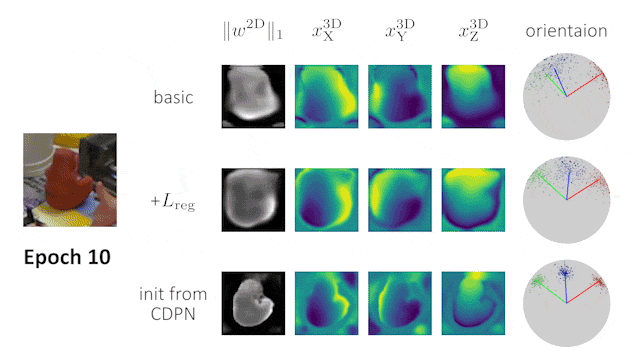

# EPro-PnP-6DoF



This is the official PyTorch implementation of End-to-End Probabilistic Perspective-n-Points for 6DoF object pose estimation. [[paper](https://arxiv.org/pdf/2203.13254.pdf)]

The code is modified from the [official implementation of CDPN](https://github.com/LZGMatrix/CDPN_ICCV2019_ZhigangLi).

## Introduction

EPro-PnP-6DoF reuses the off-the-shelf 6DoF pose estimation network CDPN. The original CDPN adopts two decoupled branches: a direct prediction branch for position, and a dense correspondence branch (PnP-based) for orientation. EPro-PnP-6DoF keeps only the dense correspondence branch (with minor modifications to the output layer for the 2-channel weight map), to which the EPro-PnP layer is appended for end-to-end 6DoF pose learning.


## Environment

The code has been tested in the environment described as follows:

- Linux (tested on Ubuntu 16.04/18.04)
- Python 3.6
- [PyTorch](https://pytorch.org/get-started/previous-versions/) 1.5.0

An example script for installing the python dependencies under CUDA 10.2:

```bash
# Create conda environment
conda create -y -n epropnp_6dof python=3.6
conda activate epropnp_6dof
conda install -y pip

# Install pytorch
conda install pytorch==1.5.0 torchvision==0.6.0 cudatoolkit=10.2 -c pytorch

# Install other dependencies
pip install opencv-python==4.5.1.48 pyro-ppl==1.4.0 PyYAML==5.4.1 matplotlib termcolor plyfile easydict scipy progress numba tensorboardx
```

## Data Preparation

Please refer to [this link](https://github.com/LZGMatrix/CDPN_ICCV2019_ZhigangLi#prepare-the-dataset) for instructions. In case you have trouble downloading the LineMOD dataset, we have uploaded a copy [here](https://mega.nz/folder/w0sTxbYa#0w-huVv5gK953mO-eGpYVg). Afterwards, the dataset folders should be structured as follows:

```
EPro-PnP-6DoF/
├── dataset/
│   ├── bg_images/
│   │   └── VOC2012/
│   └── lm/
│       ├── models/
│       │   ├── ape/
│       │   …
│       ├── imgn/
│       │   ├── ape/
│       │   …
│       ├── real_test/
│       │   ├── ape/
│       │   …
│       └── real_train/
│           ├── ape/
│           …
├── lib/    
├── tools/
…
```

## Models

### EPro-PnP-6DoF v1b

Since the experiments in the main paper (**models v1**), we have heavily refactored the code of the EPro-PnP layer, resulting in slightly different numerical behavior. We release the models trained with the current refactored code (**models v1b**) at [[Google Drive](https://drive.google.com/drive/folders/1Jem2XsdHxr3ETRsZYqyTUmo5F3TmJGfO?usp=sharing) | [Baidu Pan](https://pan.baidu.com/s/19QxntwH22O4g2oYJWMBsLg?pwd=afa8)]. The results of both versions are shown below.

| Config | Description | ADD 0.02d | ADD 0.05d | ADD 0.1d | Mean |
| :--- | :--- | :--- | :--- | :--- | :--- |
| [epropnp_basic](tools/exps_cfg/epropnp_basic.yaml) | Basic EPro-PnP | 32.14 (v1) <br> 33.05 (v1b) | 72.83 (v1) <br> 72.69 (v1b) | 92.66 (v1) <br> 92.40 (v1b) | 65.88 (v1) <br> 66.05 (v1b) |
| [epropnp_reg_loss](tools/exps_cfg/epropnp_reg_loss.yaml) | +derivative regularization| 35.44 (v1) <br> 34.78 (v1b) | 74.41 (v1) <br> 74.34 (v1b) | 93.43 (v1) <br> 93.24 (v1b) | 67.76 (v1) <br> 67.45 (v1b) |
| [epropnp_cdpn_init](tools/exps_cfg/epropnp_cdpn_init.yaml) | +init. from CDPN Stage 1 | 42.92 (v1) <br> 42.67 (v1b) | 80.98 (v1) <br> 81.07 (v1b) | 95.76 (v1) <br> 95.70 (v1b) | 73.22 (v1) <br> 73.15 (v1b) |
| [epropnp_cdpn_init_long](tools/exps_cfg/epropnp_cdpn_init_long.yaml) | +long schedule | 44.81 (v1) <br> **45.14** (v1b) | 81.96 (v1) <br> **82.21** (v1b) | 95.80 (v1) <br> **96.18** (v1b) | 74.19 (v1) <br> **74.51** (v1b) |

## Train

If you use the `epropnp_cdpn_init*` config, please download the checkpoint `cdpn_stage_1.pth` from [[Google Drive](https://drive.google.com/drive/folders/1Jem2XsdHxr3ETRsZYqyTUmo5F3TmJGfO?usp=sharing) | [Baidu Pan](https://pan.baidu.com/s/19QxntwH22O4g2oYJWMBsLg?pwd=afa8)], and move it to `EPro-PnP-6DoF/checkpoints/cdpn_stage_1.pth`.

To start training, enter the directory `EPro-PnP-6DoF/tools`, and run:

```bash
python main.py --cfg /PATH/TO/CONFIG  # configs are located in EPro-PnP-6DoF/tools/exp_cfg
```
By default GPU 0 is used, you can set the environment variable `CUDA_VISIBLE_DEVICES` to change this behavior.

Checkpoints, logs and visualizations will be saved to `EPro-PnP-6DoF/exp`. You can run TensorBoard to plot the logs:

```bash
tensorboard --logdir ../exp
```

## Test

To test and evaluate on the LineMOD test split, please edit the config file and

1. set the `load_model` option to the path of the checkpoint file,
2. change the `test` option from `False` to `True`.

After saving the test config, enter the directory `EPro-PnP-6DoF/tools`, and run:

```bash
python main.py --cfg /PATH/TO/CONFIG
```

Logs and visualizations will be saved to `EPro-PnP-6DoF/exp`.
