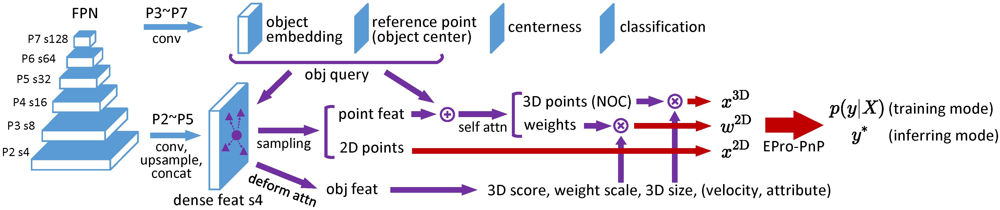

# EPro-PnP-Det


This is the official PyTorch implementation of End-to-End Probabilistic Perspective-n-Points for monocular 3D object detection. [[paper](https://arxiv.org/pdf/2203.13254.pdf)]

The code is based on [MMDetection](https://github.com/open-mmlab/mmdetection), [MMDetection3D](https://github.com/open-mmlab/mmdetection3d), and our previous work [MonoRUn](https://github.com/tjiiv-cprg/MonoRUn).

## Introduction

EPro-PnP-Det is designed for monocular 3D object detection in driving scenes. In contrast to most leading methods in this field that directly predict the center, depth and orientation of an object, EPro-PnP-Det estimates the 4DoF object pose by solving the PnP problem formulated by a set of 2D-3D points and corresponding weights. Instead of forcing the network to learn some pre-defined correspondences (e.g. keypoints) via surrogate loss functions, EPro-PnP-Det trains the network in an end-to-end manner via the novel Monte Carlo pose loss, so that the 2D-3D points and weights are treated as intermediate variables and learned from scratch.



EPro-PnP-Det extends the one-stage detector FCOS3D with a deformable correspondence network inspired by deformable DETR. For each object proposal (query), it predicts <!-- $N$ -->  2D image coordinates <!-- $x^\text{2D} \in \mathbb{R}^2$ --> , 3D object coordinates <!-- $x^\text{3D} \in \mathbb{R}^3$ -->  (in the object's local frame), and corresponding weights <!-- $w^\text{2D} \in \mathbb{R}^2_+$ --> . The correspondence set <!-- $\{x^\text{2D}_i, x^\text{3D}_i, w^\text{2D}_i|i=1 \cdots N\}$ -->  is fed into the EPro-PnP layer. The final outputs can be either samples drawn from or a mode of the probabilistic pose distribution. 

## Installation

Please refer to [INSTALL.md](INSTALL.md).

## Data Preparation

To train and evaluate the model, download the [full nuScenes dataset (v1.0)](https://www.nuscenes.org/nuscenes#download). Only the keyframe subset and metadata are required.

Create the directory `EPro-PnP-Det/data`. Extract the downloaded archives and symlink the dataset root to `EPro-PnP-Det/data/nuscenes` according to the following structure. If your folder structure is different, you may need to change the corresponding paths in config files.

```
EPro-PnP-Det/
├── configs/
├── data/
│   └── nuscenes/
│       ├── maps/
│       ├── samples/
│       ├── v1.0-test/
│       └── v1.0-trainval/
├── demo/
├── epropnp_det/
├── resources/
├── tools/
…
```

Run the following commands to pre-process the data:

```bash
python tools/data_converter/nuscenes_converter.py data/nuscenes --version v1.0-trainval
# optionally if you want to evaluate on the test set
python tools/data_converter/nuscenes_converter.py data/nuscenes --version v1.0-test
```

Note that our data converter is different from MMDetection3D, although they seem alike. If you have already converted the data in MMDetection3D's format, you still have to do another conversion in our format, which will not conflict with MMDetection3D. 

## Models

Checkpoints of all models are available for download at [[Google Drive](https://drive.google.com/drive/folders/1AWRg09fkt66I8rgrp33Lwb9l6-D6Gjrg) | [Baidu Pan](https://pan.baidu.com/s/1j7xgkwD-rcxHMaNupRP_bQ?pwd=cx5b#list/path=%2FEPro-PnP-Det)].

### EPro-PnP-Det v1

Models v1 are those reported in the main paper. All models are trained for 12 epochs on the nuScenes train/trainval split using 4 RTX 3090 GPUs. 

| Config | Description | TTA | NDS |
| :--- | :--- | :---: | :--- |
| [epropnp_det_basic](configs/epropnp_det_basic.py) | Basic EPro-PnP | ✗ | 0.425 (Val) |
| [epropnp_det_coord_regr](configs/epropnp_det_coord_regr.py) | +coord. regr.| ✗ | 0.430 (Val) |
| [epropnp_det_coord_regr](configs/epropnp_det_coord_regr.py) | +TTA | ✓ | 0.439 (Val) |
| [epropnp_det_coord_regr_trainval](configs/epropnp_det_coord_regr.py) | Use trainval split | ✓ | 0.453 (Test) |

### EPro-PnP-Det v1b

Here are some of our recent updates (mainly hyperparameter tuning) aiming at improved efficiency and accuracy, which could not make into the main paper in time. All models are trained for 12 epochs on the nuScenes train split using 2 RTX 3090 GPUs.

| Config | Description | TTA | NDS |
| :--- | :--- | :---: | :--- |
| [epropnp_det_v1b_220312](configs/epropnp_det_v1b_220312.py) | Compact network (in supplementary), N=128 | ✗ | 0.434 (Val) |
| [epropnp_det_v1b_220312](configs/epropnp_det_v1b_220312.py) | +TTA | ✓ | 0.446 (Val) |
| [epropnp_det_v1b_220411](configs/epropnp_det_v1b_220411.py) | K=128, adjust loss weight, better class handling | ✗ | 0.444 (Val) |
| [epropnp_det_v1b_220411](configs/epropnp_det_v1b_220411.py) | +TTA | ✓ | 0.453 (Val) |

## Test

To test and evaluate on the validation split, run:

```bash
python test.py /PATH/TO/CONFIG /PATH/TO/CHECKPOINT --val-set --eval nds
```

You can specify the GPUs to use by adding the `--gpu-ids` argument, e.g.:

```bash
python test.py /PATH/TO/CONFIG /PATH/TO/CHECKPOINT --val-set --eval nds --gpu-ids 0 1 2 3  # distributed test on 4 GPUs
```

To enable test-time augmentation (TTA), edit the configuration file and replace the string `flip=False` with `flip=True`.

To test on the test split and save the detection results, run:

```bash
python test.py /PATH/TO/CONFIG /PATH/TO/CHECKPOINT --format-only --eval-options jsonfile_prefix=/PATH/TO/OUTPUT/DIRECTORY
```

You can append the argument `--show-dir /PATH/TO/OUTPUT/DIRECTORY` to save visualized results.

To view other testing options, run:

```bash
python test.py -h
```

## Train

Run:

```bash
python train.py /PATH/TO/CONFIG --gpu-ids 0 1 2 3
```

Note that the total batch size is determined by the number of GPUs you specified. For EPro-PnP-Det v1 we use 4 GPUs, each processing 3 images. For EPro-PnP-Det v1b we use 2 GPUs, each processing 6 images. For these configurations we recommend GPUs with at least 24 GB of VRAM. You may edit the `samples_per_gpu` option in the config file to vary the number of images per GPU.

To view other training options, run:

```bash
python train.py -h
```

By default, logs and checkpoints will be saved to `EPro-PnP-Det/work_dirs`. You can run TensorBoard to plot the logs:

```bash
tensorboard --logdir work_dirs
```

## Inference Demo

We provide a demo script to perform inference on images in a directory and save the visualized results. Example:

```bash
python demo/infer_imgs.py /PATH/TO/DIRECTORY /PATH/TO/CONFIG /PATH/TO/CHECKPOINT --intrinsic demo/nus_cam_front.csv --show-views 3d bev mc
```

The resulting visualizations will be saved into `/PATH/TO/DIRECTORY/viz`.

Another useful script is for visualizing an entire sequence from the nuScenes dataset, so that you can create video clips from the frames. Run the following command for more information:

```bash
python demo/infer_nuscenes_sequence.py -h
```
