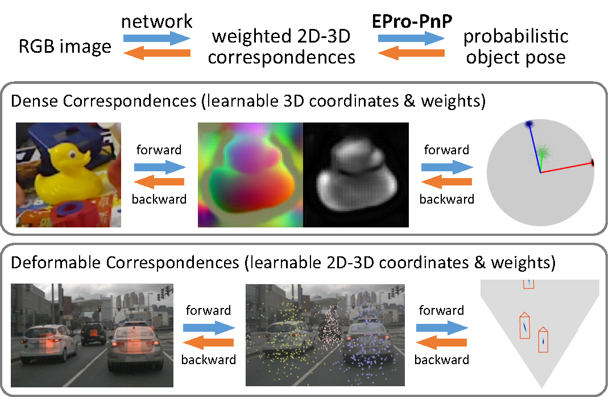

# EPro-PnP

**EPro-PnP: Generalized End-to-End Probabilistic Perspective-n-Points for Monocular Object Pose Estimation**
<br>
In CVPR 2022 (Oral, **Best Student Paper**). [[paper](https://arxiv.org/pdf/2203.13254.pdf)][[video](https://www.youtube.com/watch?v=TonBodQ6EUU)]
<br>
[Hansheng Chen](https://lakonik.github.io/)\*<sup>1,2</sup>, [Pichao Wang](https://wangpichao.github.io/)†<sup>2</sup>, [Fan Wang](https://scholar.google.com/citations?user=WCRGTHsAAAAJ&hl=en)<sup>2</sup>, [Wei Tian](https://scholar.google.com/citations?user=aYKQn88AAAAJ&hl=en)†<sup>1</sup>, [Lu Xiong](https://www.researchgate.net/scientific-contributions/Lu-Xiong-71708073)<sup>1</sup>, [Hao Li](https://scholar.google.com/citations?user=pHN-QIwAAAAJ&hl=zh-CN)<sup>2</sup>

<sup>1</sup>Tongji University, <sup>2</sup>Alibaba Group
<br>
\*Part of work done during an internship at Alibaba Group.
<br>
†Corresponding Authors: Pichao Wang, Wei Tian.

## Introduction

EPro-PnP is a probabilistic Perspective-n-Points (PnP) layer for end-to-end 6DoF pose estimation networks. Broadly speaking, it is essentially a continuous counterpart of the widely used categorical Softmax layer, and is theoretically generalizable to other learning models with nested <!-- $\mathrm{arg\,min}$ -->  optimization.



Given the layer input: an <!-- $N$ --> -point correspondence set <!-- $X = \left\{x^\text{3D}_i,x^\text{2D}_i,w^\text{2D}_i\,\middle|\,i=1\cdots N\right\}$ -->  consisting of 3D object coordinates <!-- $x^\text{3D}_i \in \mathbb{R}^3$ --> , 2D image coordinates <!-- $x^\text{2D}_i \in \mathbb{R}^2$ --> , and 2D weights <!-- $w^\text{2D}_i \in \mathbb{R}^2_+ $ --> , a conventional PnP solver searches for an optimal pose <!-- $y^\ast$ -->  (rigid transformation in SE(3)) that minimizes the weighted reprojection error. Previous work tries to backpropagate through the PnP operation, yet <!-- $y^\ast$ -->  is inherently non-differentiable due to the inner <!-- $\mathrm{arg\,min}$ -->  operation. This leads to convergence issue if all the components in <!-- $X$ -->  must be learned by the network.

In contrast, our probabilistic PnP layer outputs a posterior distribution of pose, whose probability density <!-- $p(y|X)$ -->  can be derived for proper backpropagation. The distribution is approximated via Monte Carlo sampling. With EPro-PnP, the correspondences <!-- $X$ -->  can be learned from scratch altogether by minimizing the KL divergence between the predicted and target
pose distribution.

## Models

We release two distinct networks trained with EPro-PnP:

- **[EPro-PnP-6DoF](EPro-PnP-6DoF) for 6DoF pose estimation**<br>
  

- **[EPro-PnP-Det](EPro-PnP-Det) for 3D object detection**

  

## Use EPro-PnP in Your Own Model

We provide a [demo](demo/fit_identity.ipynb) on the usage of the EPro-PnP layer.

## Citation

If you find this project useful in your research, please consider citing:

```
@inproceedings{epropnp, 
  author = {Hansheng Chen and Pichao Wang and Fan Wang and Wei Tian and Lu Xiong and Hao Li, 
  title = {EPro-PnP: Generalized End-to-End Probabilistic Perspective-n-Points for Monocular Object Pose Estimation}, 
  booktitle = {IEEE Conference on Computer Vision and Pattern Recognition (CVPR)}, 
  year = {2022}
}
```
